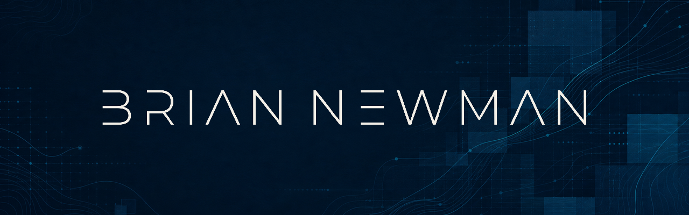

  

  

  Hands-on engineering leader working across software, data, integrations,
  automation, and AI-enabled delivery.

  <a href="https://briannewman.info">Website</a> ·
  <a href="https://briannewman.info/blog">Writing</a> ·
  <a href="https://briannewman.info/resume">Résumé</a> ·
  <a href="https://www.linkedin.com/in/brian-newman-info/">LinkedIn</a> ·
  <a href="https://x.com/newman_tech">X</a>

## What I'm building and learning

- Reliable data platforms and lakehouse architecture
- Enterprise integrations and operational automation
- Production AI systems with clear safety boundaries
- Agentic engineering workflows that strengthen delivery quality
- Small engineering teams with strong standards and low operational friction

## Tools I reach for

  

`Prefect` · `Databricks` · `dbt` · `Delta Lake` · `Pydantic` · `OpenAI`

## Latest writing

<!-- BLOG-POST-LIST:START -->
- [Engineer to Zero](https://briannewman.info/blog/engineer-to-zero)
- [My Python Data Stack in 2026](https://briannewman.info/blog/my-python-data-stack)
<!-- BLOG-POST-LIST:END -->

<picture>
  <source
    media="(prefers-color-scheme: dark)"
    srcset="./assets/contribution-snake-dark.svg"
  />
  <source
    media="(prefers-color-scheme: light)"
    srcset="./assets/contribution-snake.svg"
  />
  
</picture>
